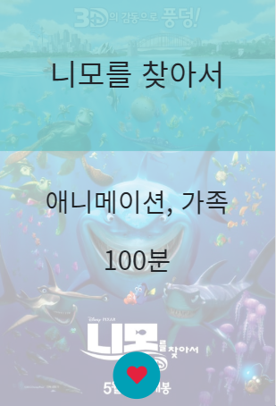

# MINTime

[TOC]

## 배포 서버 URL

http://13.124.169.106/

## 팀원 정보 및 업무 분담 내역

> 팀장: 박인영 (back: 40%, front: 60%)
>
> - json 생성, 데이터 푸시
> - 개봉년도 필터 검색 구현
> - 러닝타임 필터 검색 구현
> - manager app 기본 구현
> - movies app 기본 구현
> - premium app 기본 구현
> - accounts app 추가 구현
> - community app 추가 구현
> - kakaopay API 활용 결제 구현
> - kakaomap API 활용 지도 구현
> - daum search API 활용 이미지 검색 구현
> - 디자인
>
> - PPT 제작
>
> 팀원: 이종호 (back: 60%, front: 40%)
>
> - 좋아요한 장르 기반 추천 알고리즘 구현 (일반+프리미엄)
> - 장르 필터 검색 구현
> - accounts app 기본 구현
> - community app 기본 구현
> - manager app 추가 구현
> - movies app 추가 구현
> - premium app 추가 구현
> - kakao login API 활용 계정 연동 구현
> - 영화진흥위원회 및 네이버 영화검색 API 활용 현재상영작 호출
> - TMDB API 활용 상영예정작 호출
>
> - UCC 제작

## 목표 서비스 구현, 실제 구현 정도 및 필수 기능

### 0. 개발 도구

### 1. 영화

- 영화 목록, 페이지네이션

*DB에 있는 영화들을 페이지네이션을 활용하여 한페이지에 6개씩 보여주도록 구현하였습니다.*

- 장르, 러닝타임, 개봉년대 필터

*영화 목록 중 장르, 러닝타임, 개봉한 년대에 맞춰 목록을 가져오도록 구현하였습니다.*

*(movies/views.py 53~)*

- 영화검색

*검색창에 입력된 값과 DB에 있는 영화 제목과 비교하여 일치하는 영화 목록을 가져오도록 구현하였습니다.*

*Ajax를 활용하여 영화 제목 자동 완성기능을 추가하고 싶었지만 시간부족으로 구현하지는 못하였습니다.*

*(movies/views.py 19~)*

- 좋아요

*마우스를 올리면 좋아요 버튼과 함께 영화 제목, 장르, 러닝 타임을 볼 수 있으며, Ajax를 활용하여 좋아요 기능을 구현하였습니다.*

- 영화 세부정보

*TMDb에서 크롤링한 영화 데이터중 제목, 장르, 평점, 원제목, 언어, video link를 보여주도록 구현하였으며, 좋아요를 누른 사람들의 수를 표시하도록 하였습니다. 또한 로그인한 사용자만 간단한 리뷰와 함께 별점을 줄 수 있도록 하였습니다.*

*리뷰 수정 시 따로 수정 페이지로 이동하지 않고 같은 페이지에서 수정할 수 있도록 'lock'과 'updating' 변수를 활용하여 DTL과 javascript로 제어하였습니다.*

*movies/templates/movies/detail.html 126~*

- 프리미엄 배너

- 프리미엄 결제

*프리미엄 배너를 클릭하게되면 볼 수 있는 창으로 카카오 페이를 통해 결제시 프리미엄 회원이 될 수 있도록 구현하였습니다.*

- 카카오 페이

  *premium/views.py 13~*

- 결제 완료

*가상의 결제를 통해 결제가 완료되면 보여지는 페이지입니다.* 

*결제 취소, 결제 실패 시 해당 페이지로 넘어가게 됩니다.*

- 이벤트 배너

*어플 내부의 이벤트로 게시글작성 페이지로 연결됩니다.*  

- 자동차 극장 배너

- 자동차 극장 목록

*자동차 극장 배너 클릭시 카카오 맵의 자동차 극장 검색 결과를 보여주도록 구현되어 있습니다.*

### 2. 커뮤니티

- 게시판 구분

*클릭 시, 각 게시판의 목적에 맞는 게시글들을 보여줍니다.*

- 전체게시판

*모든 게시글을 확인할 수 있습니다.*

- 세부게시판

*자유게시판의 글을 확인할 수 있습니다.*

- 게시글 세부정보

*게시글의 제목, 작성자, 내용, 작성 시간, 수정된 시간 댓글, 댓글 작성자, 댓글 작성 시간을 확인 할수 있으며, 본인만 게시글 수정, 삭제, 댓글 삭제가 가능합니다.*

-  게시글 검색

*검색창에 입력된 값과 DB에 있는 게시글 제목과 비교하여 일치하는 게시글 목록을 가져오도록 구현하였습니다.*

- 게시글 작성

*로그인한 사용자만 게시글을 작성할 수 있으며, 게시판의 목적을 선택하여 입력할 수 있도록 하였습니다.*

### 3.관리

- 관리 페이지

*승인된 스태프만 접근할 수 있으며, 영화와 회원을 관리할 수 있는 페이지로 연결됩니다.* 

- 영화 관리

*DB에 등록되어 있는 영화를 수정, 삭제 및 새로운 영화를 추가할 수 있습니다.*

- 영화 수정

*기존의 영화를 수정할 수 있습니다.*

- 영화 추가

*새로운 영화를 추가할 수 있습니다.*

- 코드조회 클릭 시

  

*관련 사이트를 새 탭으로 띄웁니다.*

- 포스터 검색 클릭 시

*Daum 이미지 검색을 활용하여 '장고 영화 포스터'라는 검색어의 결과를 보여줍니다. 선택 시 해당 이미지의 경로가 웹 페이지의 쿠키로 자동 저장되며, 해당 쿠키의 값을 추후 DB에 저장합니다.*

- 배경 검색 클릭 시

*포스터 검색과 동작 원리가 같습니다. 다만, 검색어는 '장고 영화' 입니다.*

- 제출 시

*제출 시 해당 영화의 상세 페이지로 이동합니다.*

- 회원 관리

*가입된 회원의 스태프 권한 및 활성화를 관리할 수 있습니다. 스태프가 되면 '관리' 탭에 접근할 수 있습니다.*

### 4. 영화관 찾기

- 현재 상영작

*영화진흥위원회 API를 활용하여 박스오피스 정보를 통해 현재 상영작의 정보를 가져왔으며, 네이버 검색 API를 통해 포스트 이미지를 가져왔습니다.*

- 근처 영화관

*카카오 지도 API를 활용하여 주소를 검색하고, 검색된 위치에 마커를 생성하게 하였습니다. 또한 이떄 받아온 위치정보를 통해 해당 지역에서 문화시설 카테고리내의 영화관을 검색한 다음, 결과에 마커를 생성 및 해당 마커를 클릭시 카카오에서의 검색결과로 연결하도록 구현되어 있습니다.*

- 상영작 상세 정보

*네이버 검색 API를 통해 세부 정보를 가져왔습니다.*

### 5. 프로필

- 일반회원

*카카오 페이를 통해 가상 결제를 진행하지 않은 회원일 경우 보여지는 화면입니다.*

- 프리미엄

*카카오 페이를 통해 가상 결제를 진행한 회원일 경우 보여지는 화면입니다.*

- 프리미엄 컨텐츠

*맞춤 상영예정작 버튼을 클릭하면 보여지는 화면으로 TMDb API를 통해 받아온 개봉예정작 중 좋아요한 영화들의 장르에 속하는 영화를 보여줍니다.* 

- 이름 수정

*본인의 사용자명을 수정할 수 있습니다.*

- 추천 영화

*좋아요를 누른 영화들의 장르 정보를 모아서 가장 좋아하는 장르 2가지를 뽑은 다음, 이미 좋아요한 영화를 제외한 영화 중에서 해당 장르들을 포함하는 영화들을 추천해줍니다.*  *단, 자기자신의 프로필에서만 볼 수 있으며 다른 사람의 추천 영화는 볼 수 없습니다.*

- 작성한 게시글

*해당 프로필의 유저가 작성한 게시글을 볼 수 있습니다.*

- 작성한 댓글

*해당 프로필의 유저가 작성한 댓글을 볼 수 있습니다.*

- 좋아요한 영화

*해당 프로필의 유저가 좋아요한 영화를 볼 수 있습니다.*

- 작성한 리뷰

*해당 프로필의 유저가 작성한 리뷰를 볼 수 있습니다.*

### 6. 로그인, 회원가입, 로그아웃

- 로그인

*회원가입 한 정보를 통해 로그인 할 수 있으며, 카카오 로그인을 활용하면 가입 없이 바로 로그인이 가능합니다.*

- 회원가입

*사용자명, 비밀번호를 통해 회원가입이 가능합니다.*

- 로그아웃, 카카오 연결끊기

*카카오 연결끊기를 하게되면 해당 유저의 모든 정보를 지우게 됩니다. 로그아웃은 일반 로그아웃과 비슷한 기능을 합니다.*

## 데이터베이스 모델링(ERD)

## UI / UX

- 페이지 컨셉에 맞추어 스크롤과 드래그 색상을 민트로 변경
- 메인 페이지에서 영화가 있는 포지션으로 auto smooth scroll 적용

- group button은 각 버튼 클릭 시 active 효과 적용

- 영화 포스터에 mouseover 하면 확대되면서 상세 정보가 뜨게 함
- 메인 페이지에서 우측하단 할인 이벤트 아이콘은 일반 회원 및 비로그인 상태에서 보이게 하여 과금 유도
- 좋아요 아이콘에 mouseover하면 하트가 움직이게 함
- 영화 리뷰 수정을 누를 경우, 자동으로 맨 밑으로 스크롤을 이동시키고 원래 작성되었던 리뷰를 hidden 처리하여 '수정'하고 있다는 느낌을 강화함
- 페이지 곳곳에 뒤로가기 버튼을 배치하여 
- 대부분의 구성을 col을 사용하여 모바일 최적화
- 카카오맵 이용시 주소 버튼이 아닌 input 박스에 값을 넣어도 동작하도록 편리성 추구
- 포스터가 없을 경우 대체 이미지(No image) 적용

## 느낀점

- 이종호
  - 처음 해보는 장기 프로젝트였지만, 팀장님이 워낙 잘 이끌어 주셔서 훌륭한 결과물이 나오지 않았나 생각합니다. 특히, API를 제대로 다뤄보는 것이 처음이었지만 팀장님이 하시는 것을 보고 많이 배울 수 있었습니다. 또한 각종 bootstrap, HTML, JS 활용면에서도 워낙 잘하셔서 많은 것을 배울 수 있었던 프로젝트였습니다.

- 박인영
  - 처음엔 8일이면 충분하다고 생각했는데, 진행하면서 욕심이 생겨 이것저것 손을 대다보니 역시 '충분한 시간'이란건 없구나.. 하고 느꼈습니다. 그만큼 재미있게 프로젝트를 진행했고, 하루가 다르게 성장하는 제 자신을 볼 수 있었습니다. 막연히 이런 기능이 있었으면 좋겠다~ 하면 종호님이 구체적으로 제안해주시고, 개발 속도도 굉장히 빠르셔서 늘어지는 시간 없이 리듬감있게 프로젝트를 진행할 수 있었습니다.

## 블로그 정리

https://in0-pro.tistory.com/29